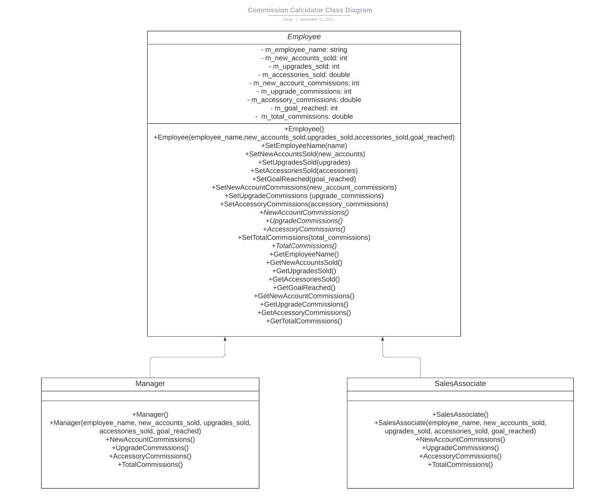
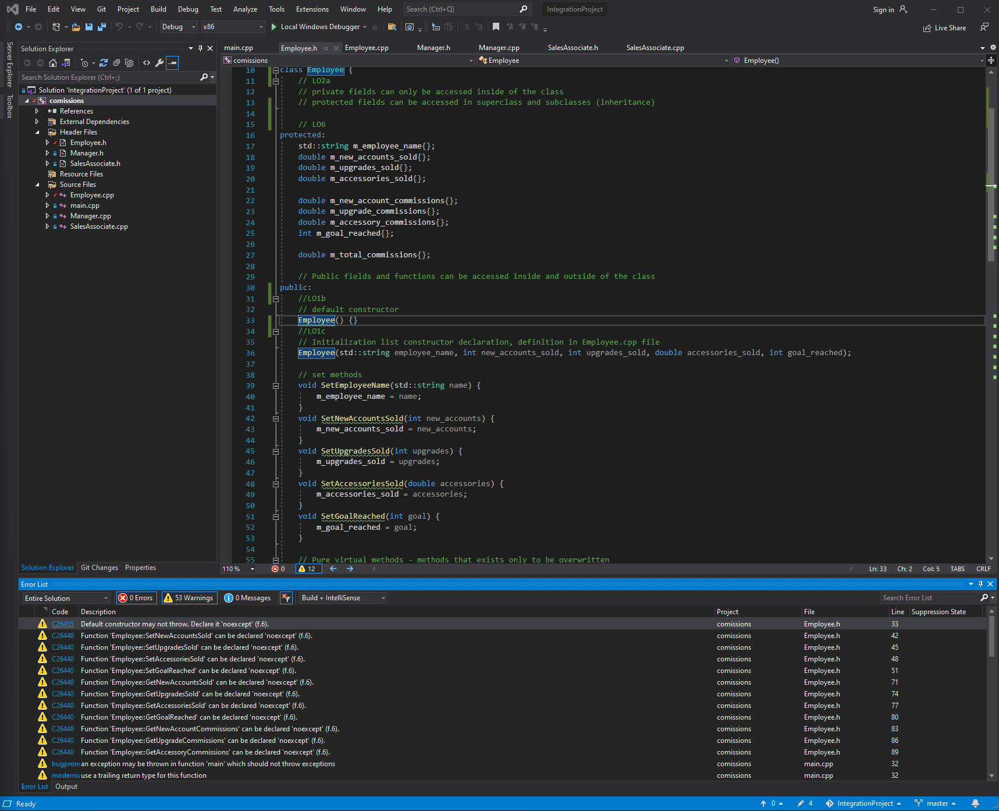
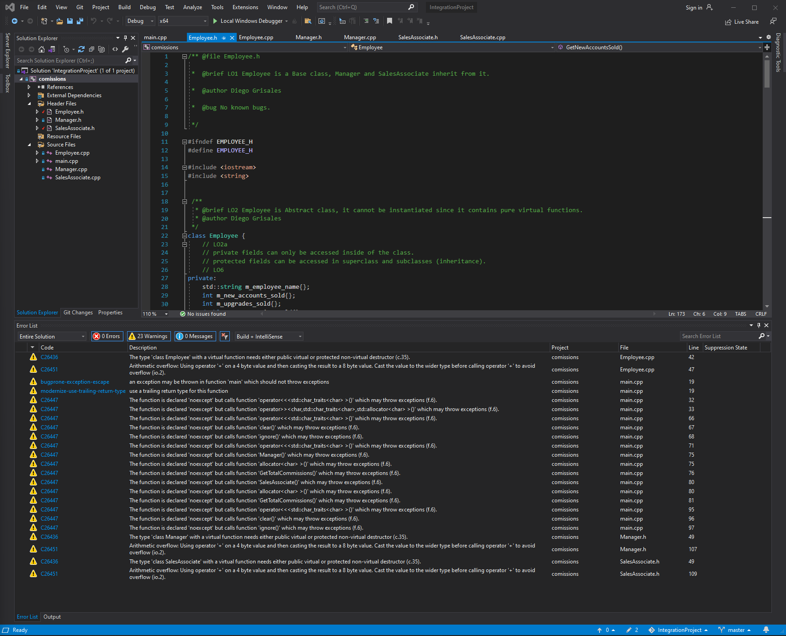

# Monthly Commission Calculator
  
## Programming II Integration Project: 
  
#### Console C++ application program designed to calculate monthly commissions per employee based on the number of cellphones and accessories they sold. The program is intended to be used by the business owners of a retail cellphone franchise to calculate how much they need to pay in commissions to each employee at the end of the month. It may also be used by the employees to keep track of how much money they have earned depending on their sales. This project is an integration of all the object-oriented methodologies that I learned in this course.

#### Project documentation using Doxygen: https://dfgrisales5078.github.io/IntegrationProject/html/pages.html

#### Project Class Diagram:

 #### Error List before vs after doing Code Analysis:
 

#### COP 3003 - Integration Project implemented using Java: https://github.com/dfgrisales5078/CommissionCalculatorJava-COP3003-IntegrationProject
